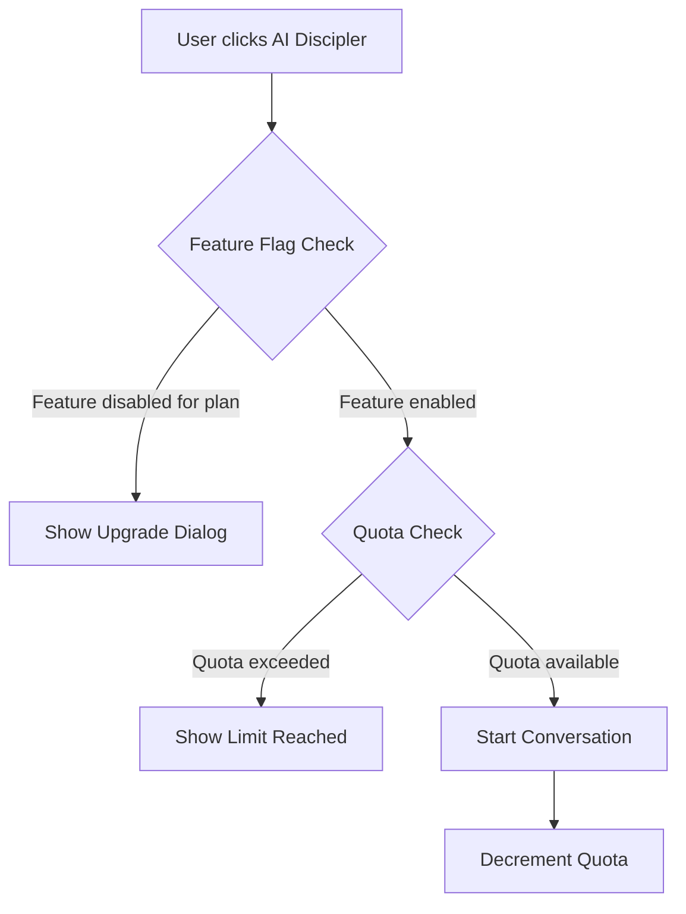

# Feature Flags vs Subscription Quotas

**Last Updated**: 2026-02-14
**Author**: System Architecture Team

## 📋 Overview

The Disciplefy app uses a **two-layer access control system** to manage feature availability and usage limits:

1. **Feature Flags** - Control WHETHER users can access features (Boolean)
2. **Subscription Quotas** - Control HOW MUCH users can use features (Numeric limits)

This separation provides flexibility for:
- Plan-based feature gating
- Gradual feature rollouts
- Usage quota enforcement
- A/B testing and experimentation

---

## 🎯 Layer 1: Feature Flags (Access Control)

### Purpose
Feature flags determine if a user **has access** to a feature based on their subscription plan.

### Database Table
```sql
feature_flags (
  id UUID PRIMARY KEY,
  feature_key TEXT UNIQUE,
  feature_name TEXT,
  description TEXT,
  is_enabled BOOLEAN,
  enabled_for_plans TEXT[],  -- ['free', 'standard', 'plus', 'premium']
  category TEXT,
  rollout_percentage INTEGER,
  created_at TIMESTAMPTZ,
  updated_at TIMESTAMPTZ
)
```

### Current Feature Flags

| Feature Key | Feature Name | Free | Standard | Plus | Premium | Category |
|-------------|--------------|------|----------|------|---------|----------|
| `ai_discipler` | AI Discipler | ❌ | ❌ | ✅ | ✅ | voice_features |
| `voice_buddy` | Voice Buddy (TTS) | ❌ | ✅ | ✅ | ✅ | voice_features |
| `study_chat` | Follow Up Chat | ❌ | ✅ | ✅ | ✅ | study_features |
| `memory_verses` | Memory Verses | ✅ | ✅ | ✅ | ✅ | core_features |
| `daily_verse` | Daily Verse | ✅ | ✅ | ✅ | ✅ | core_features |
| `reflections` | Reflections | ❌ | ✅ | ✅ | ✅ | study_features |
| `leaderboard` | Leaderboard | ✅ | ✅ | ✅ | ✅ | gamification |
| `learning_paths` | Learning Paths | ✅ | ✅ | ✅ | ✅ | core_features |

### Backend Usage
```typescript
// Check if user has access to a feature
import { isFeatureEnabledForPlan } from '../_shared/services/feature-flag-service.ts'

const userPlan = 'plus' // from user's subscription
const hasAccess = await isFeatureEnabledForPlan('ai_discipler', userPlan)

if (!hasAccess) {
  return new Response(JSON.stringify({
    error: 'FEATURE_NOT_AVAILABLE',
    message: 'AI Discipler is only available for Plus and Premium plans'
  }), { status: 403 })
}
```

### Frontend Usage
```dart
// Check if user has access to a feature
final systemConfigService = sl<SystemConfigService>();
final userPlan = tokenStatus.userPlan.name; // 'free', 'standard', 'plus', 'premium'

if (systemConfigService.isFeatureEnabled('ai_discipler', userPlan)) {
  // Show AI Discipler button
}
```

---

## 📊 Layer 2: Subscription Quotas (Usage Limits)

### Purpose
Subscription quotas determine HOW MUCH of a feature a user can use, assuming they have access via feature flags.

### Database Table
```sql
subscription_plans (
  id UUID PRIMARY KEY,
  plan_code TEXT UNIQUE,
  plan_name TEXT,
  features JSONB,  -- Contains quota limits
  ...
)
```

### Features JSONB Structure
```json
{
  "daily_tokens": 20,
  "voice_conversations_monthly": 10,
  "memory_verses": 5,
  "practice_modes": 8,
  "practice_limit": 2,
  "study_modes": ["all"]
}
```

### Current Subscription Quotas

| Quota | Free | Standard | Plus | Premium |
|-------|------|----------|------|---------|
| `daily_tokens` | 8 | 20 | 50 | ∞ (999999999) |
| `voice_conversations_monthly` | 0 | 10 | 15 | ∞ (-1) |
| `memory_verses` | 3 | 5 | 10 | ∞ (-1) |
| `practice_modes` | 2 | 8 | 8 | 8 |
| `practice_limit` | 1 | 2 | 3 | ∞ (-1) |

### Backend Usage
```typescript
// Enforce quota limits
import { VoiceConversationLimitService } from '../_shared/services/voice-conversation-limit-service.ts'

const limitService = new VoiceConversationLimitService(supabaseClient)
const limitStatus = await limitService.checkMonthlyLimit(userId, userPlan)

if (!limitStatus.canStart) {
  return new Response(JSON.stringify({
    error: 'QUOTA_EXCEEDED',
    message: `You've used ${limitStatus.conversationsUsed} of ${limitStatus.limit} conversations this month`
  }), { status: 429 })
}
```

---

## 🔄 How They Work Together

### Example: AI Discipler Voice Conversation



### Implementation Flow

**Step 1: Feature Flag Check** (Access Control)
```typescript
// Backend: voice-conversation/index.ts
const hasVoiceAccess = await isFeatureEnabledForPlan('ai_discipler', tier)

if (!hasVoiceAccess) {
  return { error: 'FEATURE_NOT_AVAILABLE' }
}
```

**Step 2: Quota Check** (Usage Limit)
```typescript
// Backend: voice-conversation/index.ts
const limitStatus = await limitService.checkMonthlyLimit(userId, tier)

if (!limitStatus.canStart) {
  return { error: 'MONTHLY_LIMIT_EXCEEDED' }
}
```

**Step 3: Consume Quota**
```typescript
// After successful operation
await limitService.incrementMonthlyCounter(userId, tier)
```

---

## 🛠️ Adding New Features

### When to Use Feature Flags
- Feature should be gated by subscription tier
- Feature is in beta/testing phase
- Need gradual rollout capability
- Want to enable/disable without code changes

### When to Use Quotas
- Feature has usage limits (tokens, API calls, etc.)
- Need to differentiate plans by quantity (10 vs 50 vs unlimited)
- Want to prevent abuse/overuse

### Implementation Checklist

#### Adding a New Feature Flag
1. **Create Migration**
   ```sql
   INSERT INTO feature_flags (
     feature_key,
     feature_name,
     description,
     is_enabled,
     enabled_for_plans,
     category
   ) VALUES (
     'new_feature',
     'New Feature',
     'Description of feature',
     true,
     ARRAY['plus', 'premium'],
     'category_name'
   );
   ```

2. **Backend Validation**
   ```typescript
   const hasAccess = await isFeatureEnabledForPlan('new_feature', userPlan)
   if (!hasAccess) {
     return { error: 'FEATURE_NOT_AVAILABLE' }
   }
   ```

3. **Frontend Check**
   ```dart
   if (systemConfigService.isFeatureEnabled('new_feature', userPlan)) {
     // Show feature
   }
   ```

#### Adding a New Quota
1. **Update Migration**
   ```sql
   UPDATE subscription_plans
   SET features = features || '{"new_quota": 100}'::jsonb
   WHERE plan_code = 'standard';
   ```

2. **Update TypeScript Interface**
   ```typescript
   interface PlanFeatures {
     new_quota: number
     // ...
   }
   ```

3. **Enforce Quota**
   ```typescript
   const quota = await getPlanConfigFromDB(userPlan)
   if (usageCount >= quota.features.new_quota) {
     return { error: 'QUOTA_EXCEEDED' }
   }
   ```

---

## 🚨 Common Pitfalls

### ❌ WRONG: Using Quotas for Access Control
```typescript
// DON'T DO THIS
if (planConfig.features.ai_discipler > 0) {
  // Allow AI Discipler
}
```
**Why**: Confuses quotas (how much) with access (yes/no)

### ✅ CORRECT: Use Feature Flags for Access
```typescript
// DO THIS
const hasAccess = await isFeatureEnabledForPlan('ai_discipler', userPlan)
if (hasAccess) {
  // Then check quota if applicable
}
```

### ❌ WRONG: Hardcoding Plan Checks
```typescript
// DON'T DO THIS
if (userPlan === 'premium' || userPlan === 'plus') {
  // Allow feature
}
```
**Why**: Not flexible, hard to change, bypasses feature flag system

### ✅ CORRECT: Use Feature Flag Service
```typescript
// DO THIS
const hasAccess = await isFeatureEnabledForPlan('feature_key', userPlan)
```

---

## 📈 Benefits

### Flexibility
- Change feature availability without code deployments
- A/B test features with rollout percentages
- Quickly disable problematic features

### Scalability
- Different quotas for different tiers
- Easy to add new subscription plans
- Independent feature and quota management

### Maintainability
- Clear separation of concerns
- Single source of truth in database
- Easy to audit and modify

---

## 🔍 Troubleshooting

### Feature Not Working for User

1. **Check Feature Flag**
   ```sql
   SELECT * FROM feature_flags WHERE feature_key = 'feature_name';
   ```
   - Is `is_enabled = true`?
   - Is user's plan in `enabled_for_plans` array?

2. **Check Quota** (if applicable)
   ```sql
   SELECT features FROM subscription_plans WHERE plan_code = 'user_plan';
   ```
   - Does user have remaining quota?

3. **Check User Plan**
   ```sql
   SELECT plan_type FROM subscriptions
   WHERE user_id = 'user_id' AND status IN ('active', 'trial');
   ```

### Feature Available But Shouldn't Be

1. Check if feature flag is enabled for wrong plans
2. Verify frontend isn't bypassing checks
3. Check for cached config (5-minute TTL)

---

## 📚 Related Documentation

- [System Config Features](/docs/architecture/System_Config_Features.md)
- [Subscription System](/docs/architecture/Subscription_System.md)
- [Admin Panel Guide](/docs/admin/Admin_Panel_Guide.md)

---

## 🔄 Changelog

- **2026-02-14**: Initial documentation
- **2026-02-14**: Added missing feature flags (memory_verses, daily_verse, reflections, leaderboard)
- **2026-02-14**: Removed conflicting fields (ai_discipler, followups from quotas)
